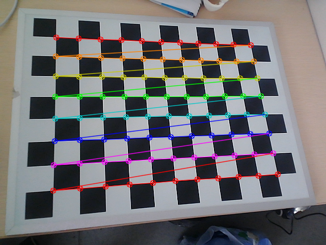
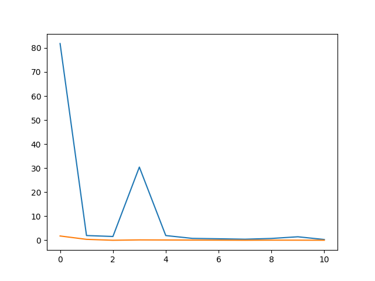

# 相机内参标定代码

### 软件格式

* python 3.8
* 依赖库:opencv-python，matplotlib

### 使用方式

>1. 先进行获取相机标定数据工作，将图片数据存在在根目录下的data文件夹
>2. 运行get_depth_scale.py 文件得到深度比例尺，存储在test文件夹depth_scale.pkl
>3. 运行get_matrix.py 文件得到相机内参和畸变系数，存储在test文件夹intrinsics.pkl与distCoeffs.pkl
>
>标定数据：
>
>
>
>误差显示（X轴表示图片数据量）：
>
>

### 测试代码

>```bash
># 输出相机内参矩阵数据
>python read_matrix.py
>```