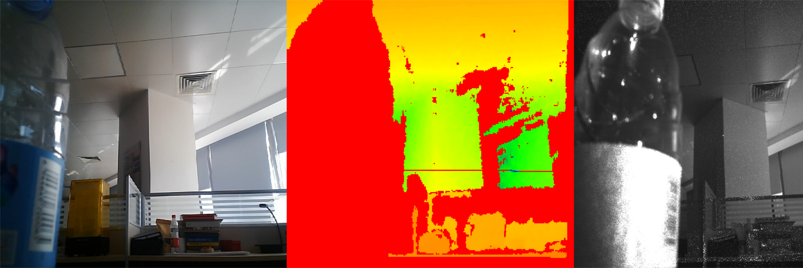

# 奥比中光深度相机驱动代码

### 相机型号

* [奥比中光Astra系列Astra+](https://www.orbbec.com.cn/index/Product/info.html?cate=38&id=9)

### 软件格式

* python 3.8
* 依赖库：openni，numpy，opencv-python

### 使用方式

>pass

### 测试代码结果

>```bash
># 获取彩色图，深度图，红外相机图
>python test_astrapro.py
>```
>
>结果:
>
>

