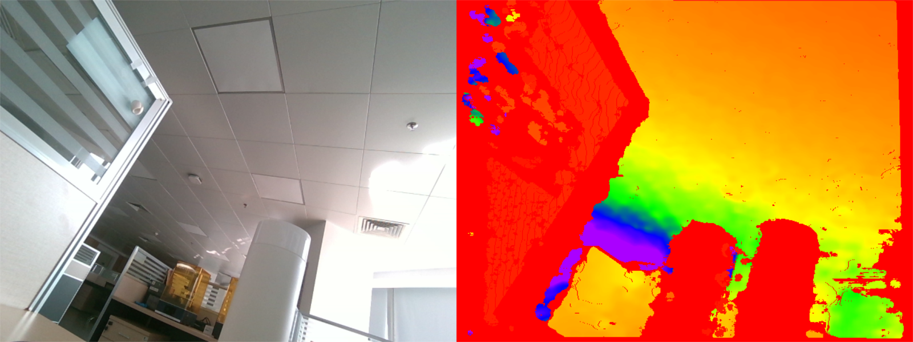

# Intel RealSense 相机驱动代码

### 相机型号

* [Intel® RealSense™ Depth Camera D455](https://www.intelrealsense.com/depth-camera-d455/)

### 软件格式

* python 3.8
* 依赖库：pyrealsense2，numpy，opencv-python

### 使用方式

>pass

### 测试代码结果

>```bash
># 获取彩色图，深度图，红外相机图
>python test_d453i.py
>```
>
>结果:
>
>

