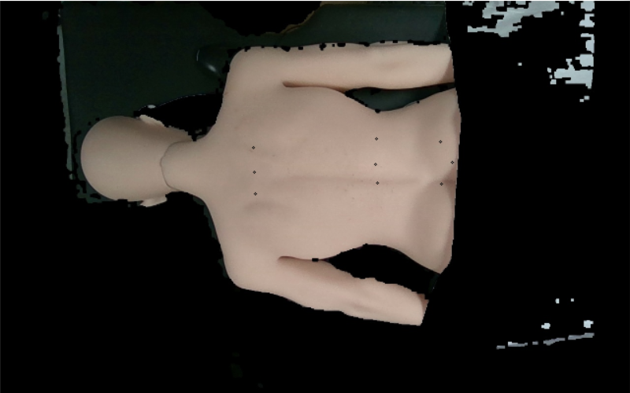

# Resnet 模型预测代码

### 软件格式

* python 3.8
* 依赖库：pytorch==1.8.0，torchvision==0.9.0，torchaudio==0.8.0，cudatoolkit=10.2，opencv-python，pandas，requests，pyyaml，tqdm，matplotlib，seaborn

### 使用方式

>pass

### 测试代码

>```bash
># 图片预测
>python test_picture.py
># 摄像头预测
>python test_capture.py
>```
>
>结果：
>
>