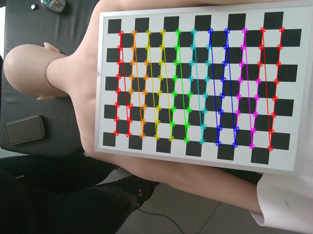

# 手眼标定代码

### 软件格式

* python 3.8
* 依赖库:opencv-python，matplotlib

### 使用方式

>1. 先进行获取手眼标定数据工作，将图片数据存在在根目录下的data文件夹
>2. 运行get_transform_matrix.py 文件得到相机坐标系到机器人坐标系的变换矩阵与机器人坐标系到相机坐标系的变换矩阵，存储在test文件夹T_cam_robot.pkl与T_robot_cam.pkl
>
>标定数据：
>
>

### 测试代码

>```bash
># 输出相机内参矩阵数据
>python read_transform_matrix.py
>```