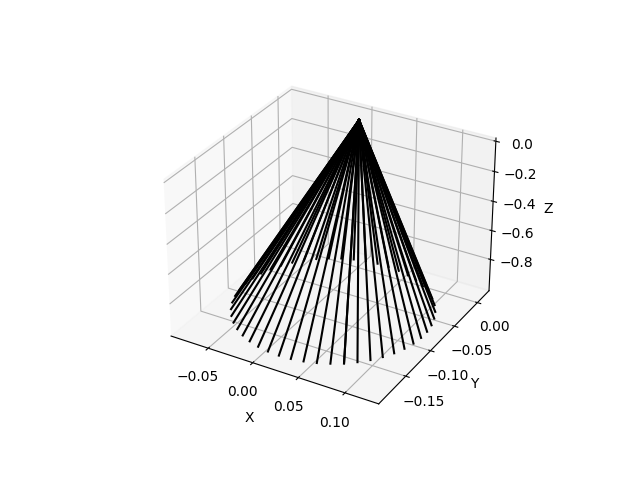

# 介绍

### 架构：


机器人控制系统通用技术：

1. 轨迹规划
2. 坐标变换

项目地址：

>* ### 轨迹规划
>
>  >驱动机械臂执行一段轨迹
>  >
>  >##### 效果：
>  >
>  >* **圆周曲线**
>  >
>  >  <u>传入末端位姿，取平移向量作为圆心，设置圆周的半径大小和插补点数，插补出圆周曲线轨迹点位</u>
>  >
>  >  * 仿真效果：
>  >
>  >    <iframe src="//player.bilibili.com/player.html?aid=524064983&bvid=BV1nM411Y78C&cid=998721637&page=1" scrolling="no" border="0" frameborder="no" framespacing="0" allowfullscreen="true"> </iframe>
>  >
>  >  * 真机效果：
>  >
>  >    <iframe src="//player.bilibili.com/player.html?aid=266591086&bvid=BV1VY411B71e&cid=998741130&page=1" scrolling="no" border="0" frameborder="no" framespacing="0" allowfullscreen="true"> </iframe>
>  >
>  >* **三次样条曲线**
>  >
>  >  <u>传入多个末端位姿，设置插补点数，插补出经过所有点位的三次样条曲线轨迹点位</u>
>  >
>  >  * 仿真效果：
>  >
>  >    <iframe src="//player.bilibili.com/player.html?aid=524064983&bvid=BV1nM411Y78C&cid=998721913&page=2" scrolling="no" border="0" frameborder="no" framespacing="0" allowfullscreen="true"> </iframe>
>  >
>  >  * 真机效果：
>  >
>  >    <iframe src="//player.bilibili.com/player.html?aid=266591086&bvid=BV1VY411B71e&cid=998741485&page=2" scrolling="no" border="0" frameborder="no" framespacing="0" allowfullscreen="true"> </iframe>
>  >
>  >* **椭圆曲线**
>  >
>  >  <u>传入末端位姿，取平移向量作为圆心，设置椭圆长半轴长度和短半轴长度以及插补点数，插补出椭圆曲线轨迹点位</u>
>  >
>  >  * 仿真效果：
>  >
>  >    <iframe src="//player.bilibili.com/player.html?aid=524064983&bvid=BV1nM411Y78C&cid=998722290&page=3" scrolling="no" border="0" frameborder="no" framespacing="0" allowfullscreen="true"> </iframe>
>  >
>  >  * 真机效果：
>  >
>  >    <iframe src="//player.bilibili.com/player.html?aid=266591086&bvid=BV1VY411B71e&cid=998742138&page=3" scrolling="no" border="0" frameborder="no" framespacing="0" allowfullscreen="true"> </iframe>
>  >
>  >* **螺旋线曲线**
>  >
>  >  <u>传入末端位姿，取平移向量作为圆心，设置最小半径和单圈扩散大小以及插补点数，插补出螺旋曲线轨迹点位</u>
>  >
>  >  * 仿真效果：
>  >
>  >    <iframe src="//player.bilibili.com/player.html?aid=524064983&bvid=BV1nM411Y78C&cid=998728335&page=6" scrolling="no" border="0" frameborder="no" framespacing="0" allowfullscreen="true"> </iframe>
>  >
>  >  * 真机效果：
>  >
>  >    <iframe src="//player.bilibili.com/player.html?aid=266591086&bvid=BV1VY411B71e&cid=998742710&page=6" scrolling="no" border="0" frameborder="no" framespacing="0" allowfullscreen="true"> </iframe>
>  >
>  >* **单一方向往返**
>  >
>  >  <u>传入末端位姿，取平移向量作为中点，设置点间间隔和插补点数，插补出往返轨迹点位</u>
>  >
>  >  * 仿真效果：
>  >
>  >    <iframe src="//player.bilibili.com/player.html?aid=524064983&bvid=BV1nM411Y78C&cid=998724151&page=7" scrolling="no" border="0" frameborder="no" framespacing="0" allowfullscreen="true"> </iframe>
>  >
>  >  * 真机效果：
>  >
>  >    <iframe src="//player.bilibili.com/player.html?aid=266591086&bvid=BV1VY411B71e&cid=998743223&page=7" scrolling="no" border="0" frameborder="no" framespacing="0" allowfullscreen="true"> </iframe>
>  >
>  >* **多点间线性**
>  >
>  >  <u>传入多个末端位姿，设置插补点数，插补出经过所有点位的直线轨迹点位</u>
>  >
>  >  * 仿真效果：
>  >
>  >    <iframe src="//player.bilibili.com/player.html?aid=524064983&bvid=BV1nM411Y78C&cid=998724756&page=8" scrolling="no" border="0" frameborder="no" framespacing="0" allowfullscreen="true"> </iframe>
>  >
>  >  * 真机效果：
>  >
>  >    <iframe src="//player.bilibili.com/player.html?aid=266591086&bvid=BV1VY411B71e&cid=998743433&page=8" scrolling="no" border="0" frameborder="no" framespacing="0" allowfullscreen="true"> </iframe>
>  >
>  >* **两点间线性**
>  >
>  >  <u>传入两个末端位姿，设置插补点数，插补出直线轨迹点位</u>
>  >
>  >  * 仿真效果：
>  >
>  >    <iframe src="//player.bilibili.com/player.html?aid=524064983&bvid=BV1nM411Y78C&cid=998725424&page=9" scrolling="no" border="0" frameborder="no" framespacing="0" allowfullscreen="true"> </iframe>
>  >
>  >  * 真机效果：
>  >
>  >    <iframe src="//player.bilibili.com/player.html?aid=266591086&bvid=BV1VY411B71e&cid=998743703&page=9" scrolling="no" border="0" frameborder="no" framespacing="0" allowfullscreen="true"> </iframe>
>  >
>  >* **合成运动**
>  >
>  >  <u>多个轨迹进行合成</u>
>  >
>  >  * 仿真效果：
>  >
>  >    <iframe src="//player.bilibili.com/player.html?aid=524064983&bvid=BV1nM411Y78C&cid=998726219&page=10" scrolling="no" border="0" frameborder="no" framespacing="0" allowfullscreen="true"> </iframe>
>  >
>  >  * 真机效果：
>  >
>  >    <iframe src="//player.bilibili.com/player.html?aid=266591086&bvid=BV1VY411B71e&cid=998744520&page=10" scrolling="no" border="0" frameborder="no" framespacing="0" allowfullscreen="true"> </iframe>
>  >
>  >* **合成运动**
>  >
>  >  * 仿真效果：
>  >
>  >    <iframe src="//player.bilibili.com/player.html?aid=524064983&bvid=BV1nM411Y78C&cid=998727988&page=11" scrolling="no" border="0" frameborder="no" framespacing="0" allowfullscreen="true"> </iframe>
>  >
>  >  * 真机效果：
>  >
>  >    <iframe src="//player.bilibili.com/player.html?aid=266591086&bvid=BV1VY411B71e&cid=998745991&page=11" scrolling="no" border="0" frameborder="no" framespacing="0" allowfullscreen="true"> </iframe>
>  >
>  >* **姿态slerp插补**
>  >
>  >  <u>传入两个末端位姿，取旋转向量转为四元数，通过四元数运算进行姿态轨迹插补</u>
>  >
>  >  * 仿真效果：
>  >
>  >    <iframe src="//player.bilibili.com/player.html?aid=524064983&bvid=BV1nM411Y78C&cid=998722685&page=4" scrolling="no" border="0" frameborder="no" framespacing="0" allowfullscreen="true"> </iframe>
>  >
>  >  * 真机效果：
>  >
>  >    <iframe src="//player.bilibili.com/player.html?aid=266591086&bvid=BV1VY411B71e&cid=998742243&page=4" scrolling="no" border="0" frameborder="no" framespacing="0" allowfullscreen="true"> </iframe>
>  >
>  >* **姿态cone插补**
>  >
>  >  <u>设置空间圆锥锥度以及插补点数，进行姿态插补轨迹规划</u>
>  >
>  >  * 仿真效果：
>  >
>  >    <iframe src="//player.bilibili.com/player.html?aid=524064983&bvid=BV1nM411Y78C&cid=998723701&page=5" scrolling="no" border="0" frameborder="no" framespacing="0" allowfullscreen="true"> </iframe>
>  >
>  >  * 真机效果：
>  >
>  >    <iframe src="//player.bilibili.com/player.html?aid=266591086&bvid=BV1VY411B71e&cid=998742504&page=5" scrolling="no" border="0" frameborder="no" framespacing="0" allowfullscreen="true"> </iframe>
>
>* ### AI识别
>
>  >训练Resnet模型，并采用模型对图像进行关键点检测
>
>* ### 手眼标定
>
>  >明确机械臂基坐标系与相机坐标系/工作台坐标系之间的空间变换
>  >
>  >手眼标定数据：

# 使用

>* 必备部分
>  * 硬件
>    * 机械臂
>    * ~~相机~~
>  * 算法控制
>* 扩展部分
>  * 仿真
>  * 更换其他机器臂
>  * 更换其他深度相机
>  * ~~或者不需要使用相机~~
>
>根据功能选择，复制相关文件夹，建议保持与框架一致的目录结构
>
>```
># 最小功能项目演示
># 控制节卡机械臂进行一定轨迹的运动
>项目
>---core
>	---TrajectoryPlan
>	---Utilities
>	---RobotDemo
>---ApplyRobot.py
>---test.py
>```
>
>其他更详细的演示项目：
>
>* 按摩机器人
>* 扫描机器人
>* 夹取机器人

# 未来工作

><u>加入pca算法分析点云得出表面法向量</u>