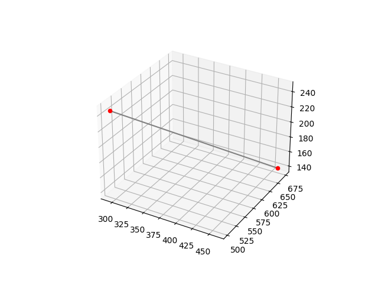
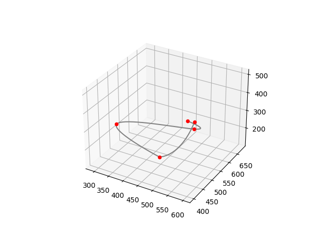
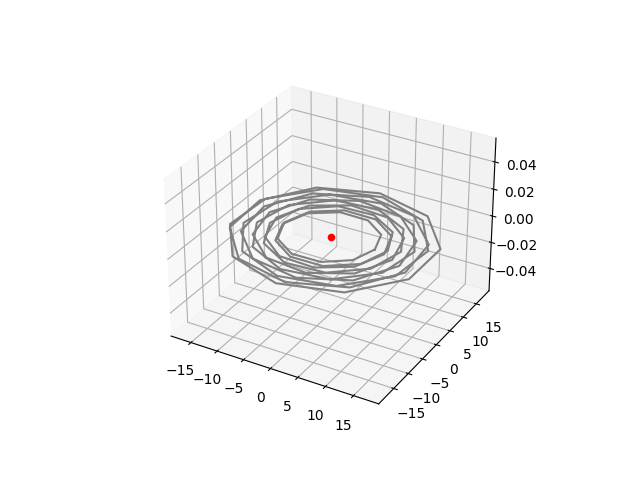
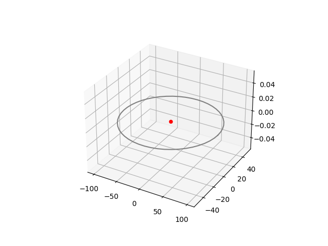
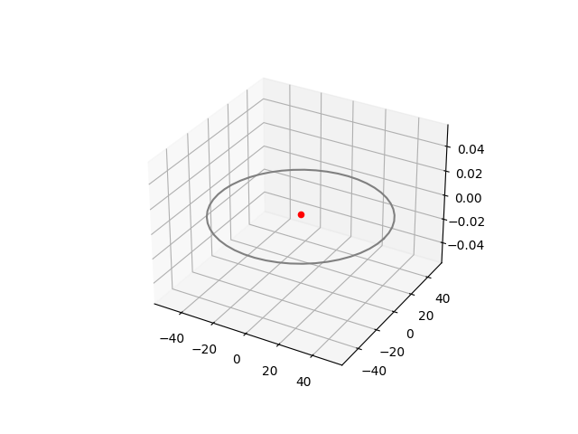
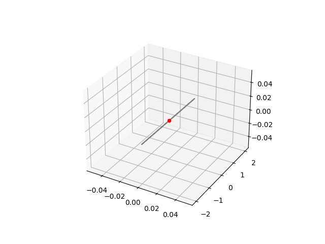
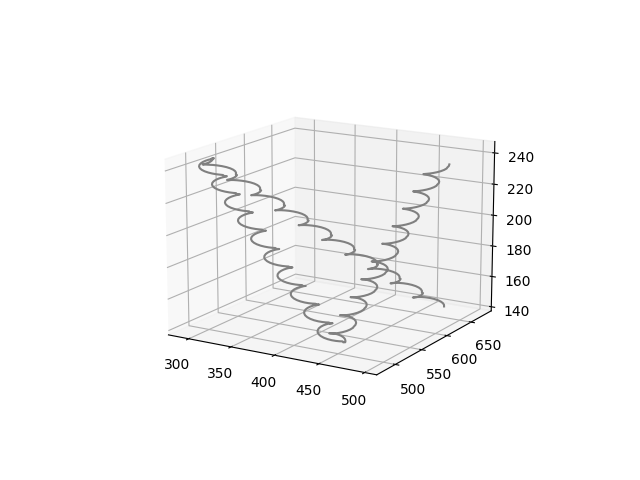
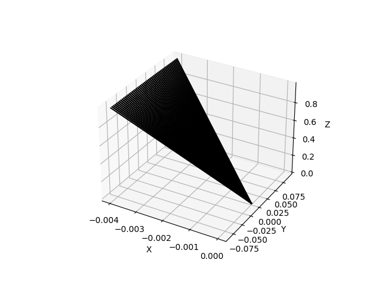
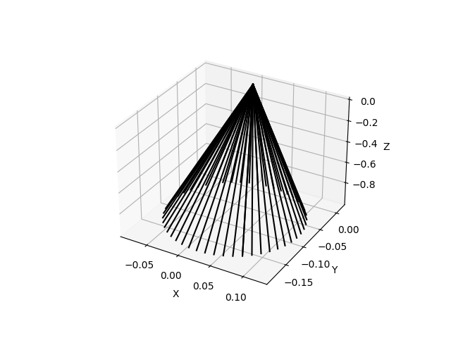

# 轨迹规划器

### 软件格式

* python 3.8
* 依赖库：自定义Utilities， numpy，matplotlib，scipy

### 使用方式

>pass

### 测试代码

>* SimpleLinearPlan(简单线性规划)
>
>  
>
>* LinearPlan(线性轨迹规划)
>
>  
>
>* CubicSplinePlan(三次样条轨迹规划)
>
>  
>
>* HelicalPlan(螺旋运动)
>
>  
>
>* EllipsePlan(椭圆运动)
>
>  
>
>* CirclePlan(圆周运动)
>
>  
>
>* LevelStraightPlan(水平直线运动)
>
>  
>
>* Synthesizer(运动合成器)
>
>  
>
>  
>
>* GesturePlan(姿态插补)
>
>  
>
>  
>
>  
>
>  
>
>  

